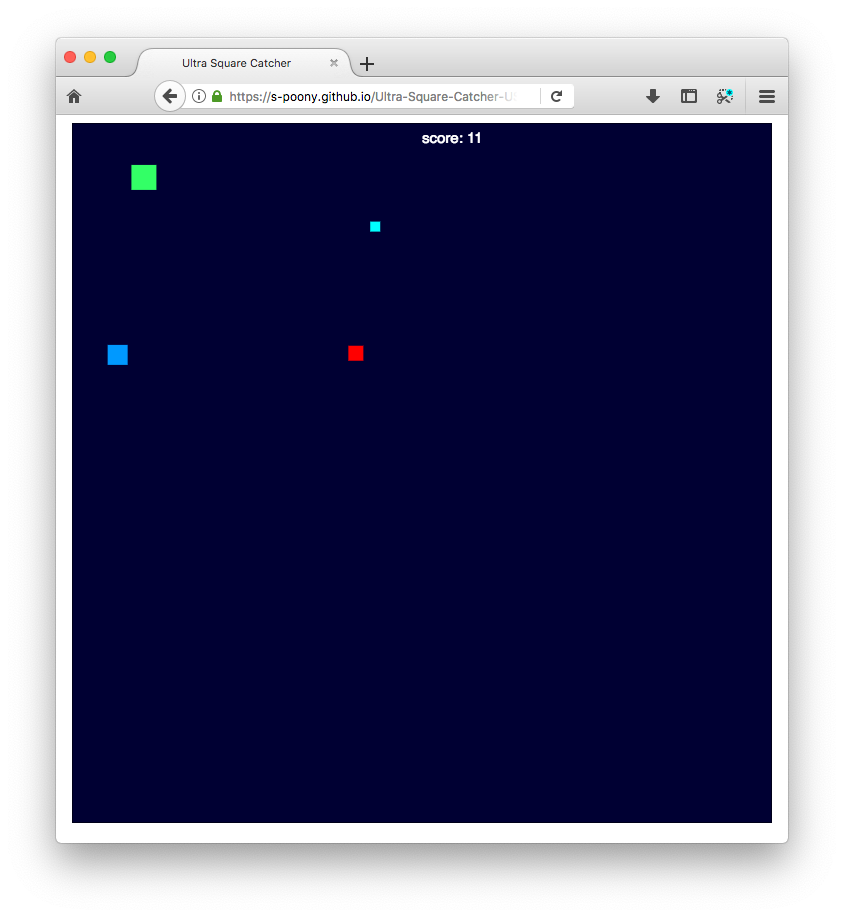

# [Ultra Square Catcher](https://s-poony.github.io/Ultra-Square-Catcher-USC-/jeuvideo.html)

You are a green square catcher. Your goal is to catch blue squares in order to increase your score. But be careful: the evil red square is jealous and wants to steal your points!

  

Lore:

The World: At the beginning, there was nothing. The World, the dark blue square. The World created and continues to create squares in his image, with four sides and a color.

Square Catcher: You! A wild green square that is looking for blue squares to collect.

Blue squares: A pretty common type of squares. They aren't alive, but they give points if they are caught. Legend says they come from the original dark blue square...

Cyan squares: A less common, more juicy type of blue squares. They give more points too!

Red: The rival of the green square, he is jealous of you because he can't catch the blue squares, so he tries to steal your points instead!

Thief: This pink square is the younger brother of Red. He is really good at catching blue squares, but he doesn't like cyan ones. He can't really harm you.
